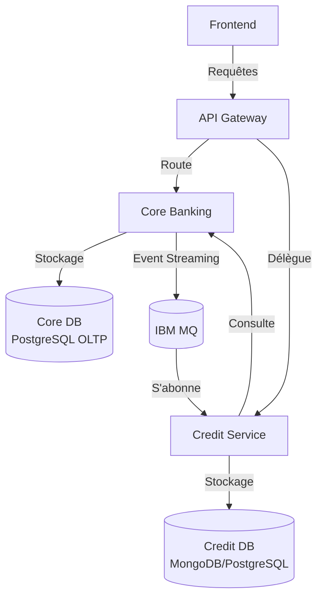

# banking-api

```mermaid
graph TD
    A[Frontend] -->|Requêtes| B[API Gateway]
    B -->|Route| C[Core Banking]
    C -->|Stockage| D[(Core DB<br>PostgreSQL OLTP)]
    B -->|Délègue| E[Credit Service]
    E -->|Stockage| F[(Credit DB<br>MongoDB/PostgreSQL)]
    E -->|Consulte| C
    C -->|Event Streaming| G[(IBM MQ)]
    G -->|S'abonne| E
```

