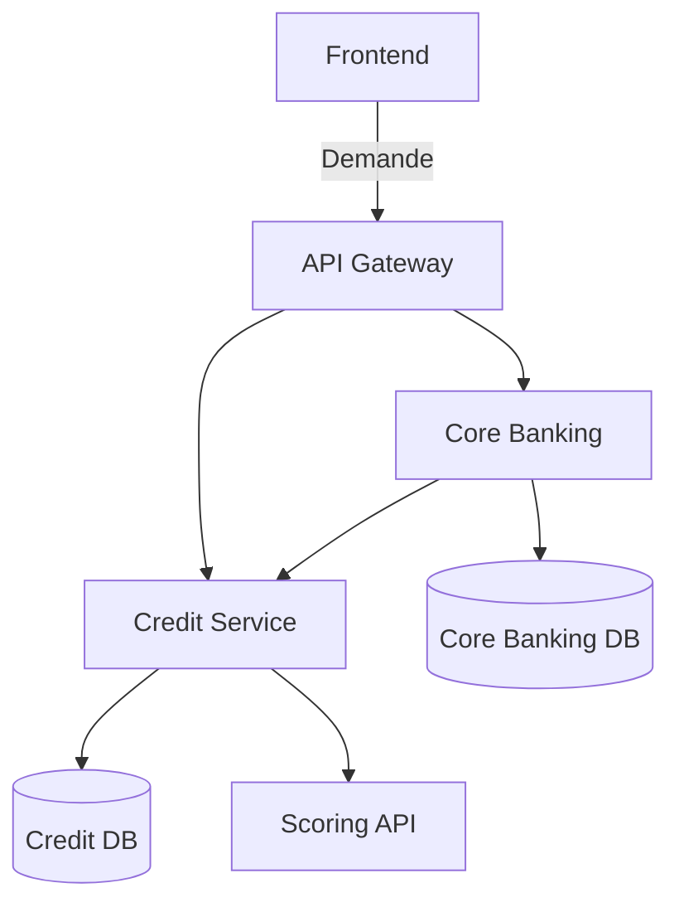

# banking-api

```mermaid
graph TD
    A[Frontend] -->|Demande| B[API Gateway]
    B --> C[Core Banking]
    B --> D[Credit Service]
    D --> E[(Credit DB)]
    D --> F[Scoring API]
    C --> D
    C --> G[(Core Banking DB)]
```

